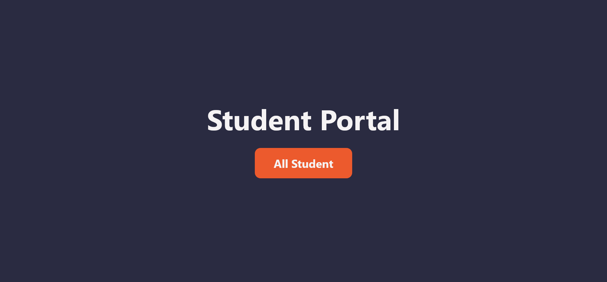
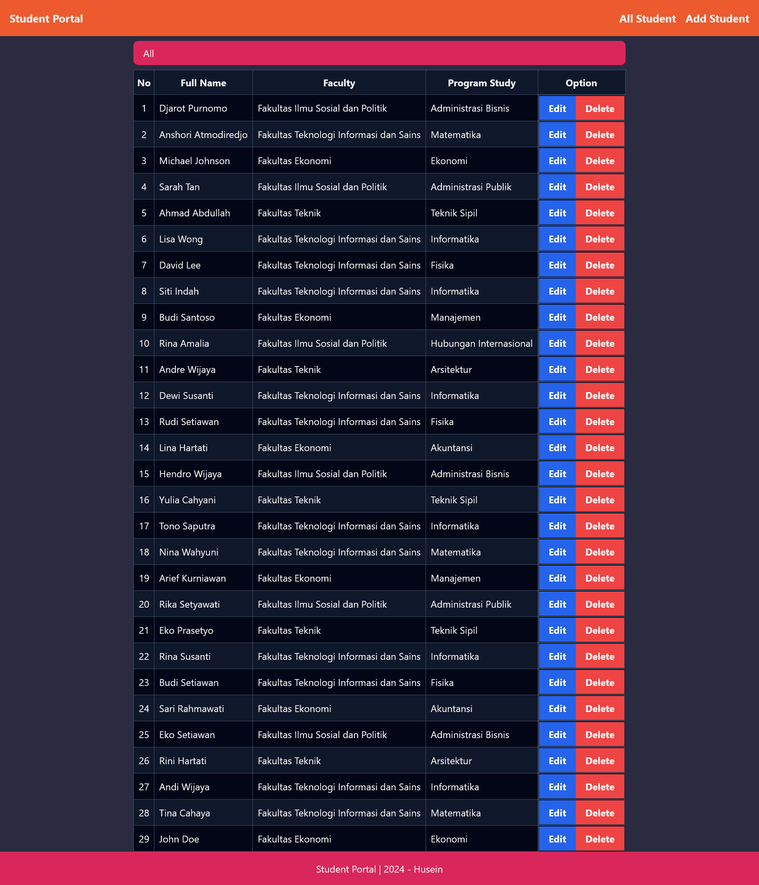

# Student Portal

This is a React Student Portal App Project created using React + React Router and Tailwind for the styling.

## Tech Stack

- React
- React Router
- Tailwind CSS
- JSON-Server

## Run Locally

Clone the project

```bash
  git clone https://github.com/fedexid/student-portal
```

Go to the project directory

```bash
  cd student-portal
```

Install dependencies

```bash
  npm install
```

Start the JSON Server

```bash
  npm run start:server
```

Start the App

```bash
  npm run dev
```

## Screenshots



---


